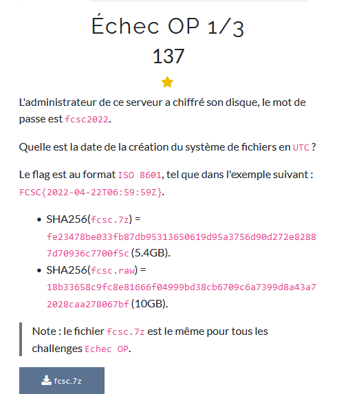
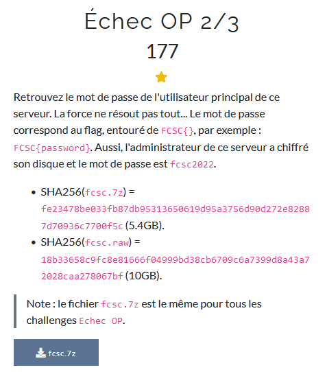
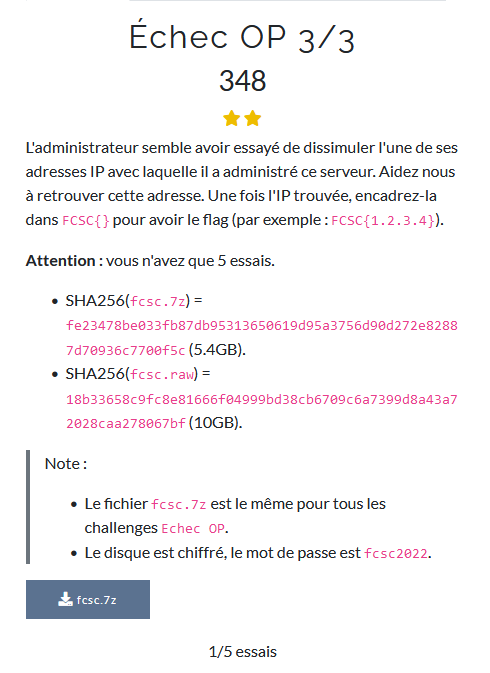

 # Echec OP 1/3
 
 
 Nous avons donc un fichier 7z. En le décompressant on retrouve un fichier fcsc.raw 
 
 ```bash
 file fcsc.raw
fcsc.raw: DOS/MBR boot sector, extended partition table (last)
 ```
 
 il s'agit donc d'une partition.
 Nous savons seulement que l'administrateur a chiffré son disque et nous avons le mot de passe du disque `fcsc2022

Dans un premier temps nous devons identifier quelle partition est intéressante et surtout où ce situe les données.

 ```bash
 fdisk -l fcsc.raw
Disk fcsc.raw: 10 GiB, 10737418240 bytes, 20971520 sectors
Units: sectors of 1 * 512 = 512 bytes
Sector size (logical/physical): 512 bytes / 512 bytes
I/O size (minimum/optimal): 512 bytes / 512 bytes
Disklabel type: gpt
Disk identifier: 60DA4A85-6F6F-4043-8A38-0AB83853E6DC

Device       Start      End  Sectors  Size Type
fcsc.raw1     2048     4095     2048    1M BIOS boot
fcsc.raw2     4096  1861631  1857536  907M Linux filesystem
fcsc.raw3  1861632 20969471 19107840  9.1G Linux filesystem
```

On peut voir ici que la partition fcsc.raw3 commence au secteur `1861632`

On peut maintenant regarder avec quoi elle a été chiffré

```bash
hexdump -C -s $((512*1861632)) -n 16 fcsc.raw
38d00000  4c 55 4b 53 ba be 00 02  00 00 00 00 00 00 40 00  |LUKS..........@.|
```

Maintenant que nous savons avec quoi la partition a été chiffré, nous pouvons regarder comment la déchiffrer.

```bash
sudo losetup -f -P fcsc.raw 
udisksctl unlock -b /dev/loop0p3 
vgdisplay 
vgrename <VG UUID> diskfcsc
modprobe dm-mod 
vgchange -ay 
lvscan 
mount /dev/ubunu-vg/ubuntu-lv decrypted/ 
```
J'ai pas mal galéré mais le disque est maintenant déchiffré et monté.

Il nous reste plus qu'a trouvé la date de création du système de fichier avec ces deux commandes. 

```bash
cd decrypted
ls -aclt /root
tune2fs -l /ubuntu-vg/ubuntu-lv | grep created
```

Attention au format et à l'UTC. 
J'ai perdu mon flag, veuillez m'excuser.

# Echec OP 2/3 


Pour trouver le mot de passe de l'utilisateur : 

```bash
cat root/.bash_history
exit
passwd obob 
CZSITvQm2MBT+n1nxgghCJ
exit
```

Rien d'autre à dire
`Flag : FCSC{CZSITvQm2MBT+n1nxgghCJ}`

# Echec OP 3/3


Ici, nous devons trouver l'ip de la machine attaquante. Malheuresement nous manquions de fichier de log.

Un fichier de log intéréssant était fail2ban.log

```bash

cat var/log/fail2ban.log
```

Dans ce fichier nous pouvons apercevoir que le fichier auth.log a été supprimer (probablement pour effacer des traces)

`auth.log remove`

On utilise donc ext4magic pour récupérer tous les fichiers supprimé 

```bash
ext4magic /dev/ubuntu-vg/ubntu-lv -M -d /mnt/disk
```

Les fichiers supprimer sont stocké dans un dossier MAGIC-2 et MAGIC-3. Le soucis est que leurs noms ne sont pas intéligible.  
On sort donc notre meilleur grep récursif.

```bash
grep -rnw "sshd" MAGIC-2/
```
Après quelques minutes: 

sshd[192.168.1.37 ...
`Flag : FCSC{192.168.1.37}`

#chall 