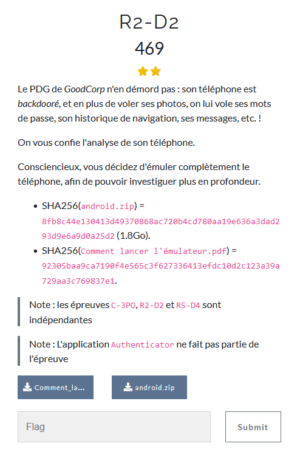
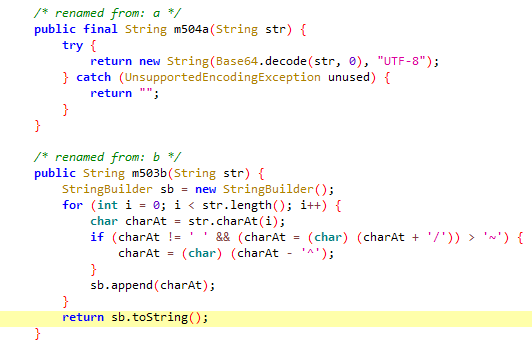
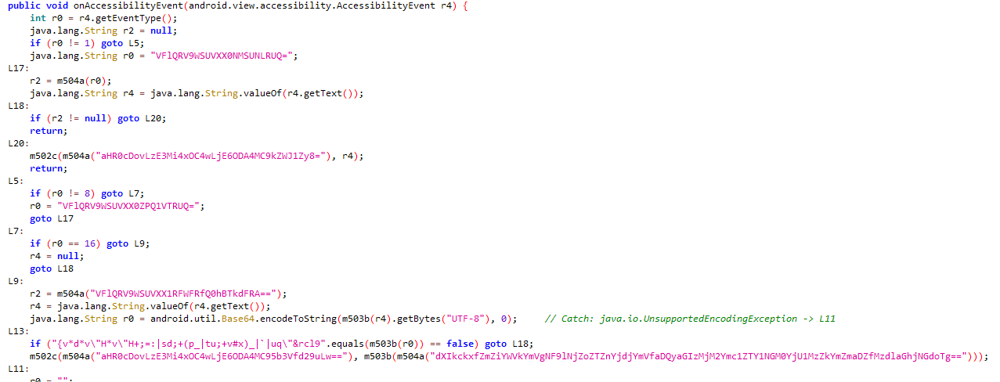

# R2-D2


Une fois le téléphone émulé correctement, nous pouvons commencer l'analyse.

Nous savons qu'il s'agit d'une backdoor, probablement une application légitime modifée ou une application malveillante.

J'ai donc commencé par lister les packages présents dans le téléphone.

```bash
adb shell pm list packages
```

Pour l'instant pas grand-chose d'intéressant.
J'ai vu passer dans un article que l'option `-f` permettait d'obtenir le nom des apk.

Nous trouvons alors, authenticator2 (base.apk) d'après l'énnoncé, ce n'est pas le l'apk intéressant ici, mais essayons de trouver un apk qui y ressemble. 

Je fais donc cette même commande avec le grep magique.

```bash
adb shell pm list packages | grep base.apk
```

On peut observer maintenant une application qui se nomme `greek`.

Concentrons nos efforts dessus pour essayer de trouver des choses.

Je l'ouvre dans jadx-gui et nous avons une première class 
`KeyBoard` qui contient certaines méthodes intéressantes.



Nous pouvons remarquer plusieurs traitement sur une information. si on descend plus bas on retrouve la chaîne de caractère encodé passé en paramètre de ces deux methodes.



On réimplémente le traitement en java et on affiche pour obtenir le flag. 

```java
import java.util.Base64;
import java.nio.charset.StandardCharsets;

class  Main {
  public static void main(String[] args) {
    
    String str = "dXIkckxfZmZiYWVkYmVgNF9lNjZoZTZnYjdjYmVfaDQyaGIzMjM2Ymc1ZTY1NGM0YjU1MzZkYmZmaDZfMzdlaGhjNGdoTg==";
    byte[] bytes = str.getBytes(StandardCharsets.UTF_8);
    byte[] decoded = Base64.getDecoder().decode(bytes);
    String s = new String(decoded, StandardCharsets.UTF_8);
    StringBuilder sb = new StringBuilder();
    for (int i = 0; i < s.length(); i++) {
      char charAt = s.charAt(i);
      if (charAt != ' ' && (charAt = (char) (charAt + '/')) > '~') {
            charAt = (char) (charAt - '^');
      }
      sb.append(charAt);
    }
    System.out.println(sb.toString());
  }
                
}
```

